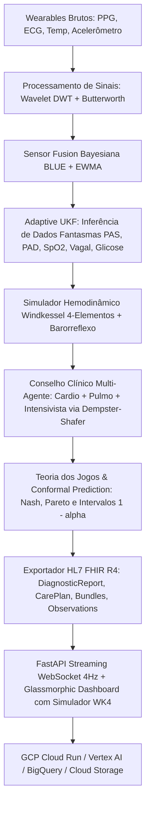

# 🏥 HealthTech — Advanced Biomedical Intelligence & Telemetry Platform

[](https://github.com/leanderdulac/healthtech/actions)
[](https://github.com/leanderdulac/healthtech/actions)
[](https://github.com/leanderdulac/healthtech/releases)
[](https://www.python.org/)
[](http://hl7.org/fhir/R4/)
[](LICENSE)

---

## 🌐 Visão Geral

A **HealthTech** é uma plataforma médica de alta precisão que combina **Física Cardiovascular Computacional (Windkessel 4-Elementos & Navier-Stokes 3D)**, **Inferência Estocástica em Espaço de Estados (Adaptive UKF & Dados Fantasmas)**, **Fusão Sensorial Bayesiana (BLUE)**, **Conselho Clínico Multi-Agente (Dempster-Shafer)**, **Calibração Estatística Conforme (Split Conformal 1-α)** e **Interoperabilidade Nativa HL7 FHIR R4**.

O sistema opera sobre arquitetura **Medallion Lakehouse (Bronze / Silver / Gold)** com suporte nativo para nuvem (GCP Cloud Run, Vertex AI e BigQuery).

---

## 📐 Arquitetura do Sistema



---

## 🔬 Módulos Científicos e Engenharia

1. **Processamento de Sinais & Separação de Ruído (`src/signal_processing/`)**:
   - Processos de Ornstein-Uhlenbeck ($dX_t = \theta(\mu - X_t)dt + \sigma dW_t$).
   - DWT Denoising com decomposição Wavelet `db4` e limiarização universal de Donoho-Johnstone.
   - Fusão Sensorial Bayesiana BLUE com pesos inversamente proporcionais à variância instantânea.

2. **Espaço de Estados & Dados Fantasmas (`src/phantom_data/`)**:
   - Extended Kalman Filter (EKF) e Unscented Kalman Filter (UKF).
   - **Adaptive Unscented Kalman Filter (A-UKF)** com adaptação online de Sage-Husa para matrizes de ruído $Q$ e $R$.
   - Análise espectral de HRV (SDNN, RMSSD, pNN50, Densidade Espectral de Potência Welch, Lomb-Scargle e SampEn).
   - Verificação do **Gramiano de Observabilidade** $\mathcal{W}_o$ para certificação de reconstruibilidade de biomarcadores.

3. **Hemodinâmica Computacional (`src/hemodynamics/`)**:
   - **Modelo Windkessel de 4 Elementos (WK4)**: Resistência Periférica ($R_p$), Complacência ($C$), Impedância Aórtica ($Z_c$) e Inertância ($L$) integrado via RK4.
   - Cálculo da Velocidade da Onda de Pulso (PWV) via equação de Bramwell-Hill.
   - Alça de regulação autonômica do **Barorreflexo** para estabilização de PAM e FC.
   - Operadores diferenciais 3D em malha contínua: $\nabla \phi$, $\nabla \cdot \mathbf{u}$, $\nabla \times \mathbf{u}$.

4. **Inteligência Clínica & Teoria dos Jogos (`src/clinical_intelligence/`)**:
   - Motor de Teoria dos Jogos para alinhamento de incentivos clínicos (Evasão de Alta AMA, Overtreatment, Dilema do Plantonista).
   - **Triage Game Engine**: Alocação ótima de leitos hospitalares e UTI via Equilíbrio de Nash e Fronteira de Pareto.
   - **Split Conformal Predictor**: Intervalos de probabilidade com garantia teórica de cobertura $\ge 1 - \alpha$.

5. **Interoperabilidade em Saúde (`src/fhir/`)**:
   - Serialização e validação nativa HL7 FHIR Release 4 (Patient, Observation, Device, Flag, Bundle).

6. **Medallion Lakehouse (`src/datalake/`)**:
   - Camada Bronze (telemetria bruta particionada por data).
   - Camada Silver (reconciliação temporal e flags de qualidade).
   - Camada Gold (resumos horários, diários e alertas clínicos agregados).

---

## 🚀 Como Executar

### 1. Pré-requisitos
- Python 3.10 ou 3.11
- Gerenciador de pacotes `pip`

### 2. Instalação
```bash
git clone https://github.com/leanderdulac/healthtech.git
cd healthtech
pip install -r requirements.txt
<<<<<<< HEAD
# opcional (dev/CI):
pip install -r requirements-dev.txt
cp .env.example .env   # configure GCP, SECRET_SALT e API_KEY
```

### Segurança (obrigatório em produção)

| Variável | Descrição |
|----------|-----------|
| `ENVIRONMENT` | `development` ou `production` |
| `SECRET_SALT` | Salt forte para hash de IDs FHIR (`openssl rand -hex 32`) |
| `API_KEY` | Chave para header `X-API-Key` nas APIs |
| `AUTH_DISABLED` | `true` só em dev local (ignorado em production) |
| `CORS_ORIGINS` | Origens permitidas, separadas por vírgula |

Endpoints `/health` e `/api/health` são públicos (probes). Demais rotas exigem API key quando configurada.

### API secure vs monólito full

| `APP_MODE` | Entry point | Conteúdo |
|------------|-------------|----------|
| `full` (padrão no monólito) | `uvicorn src.api_server:app` ou `APP_MODE=full uvicorn app.main:app` | Dashboard, WebSocket, phantom/Kalman, Vertex, RAG |
| `secure` | `cd saude_responsiva_secure && uvicorn app.main:app` | API enxuta: scopes, rate limit, LGPD, anti-IDOR |

Pacote dedicado: [`saude_responsiva_secure/`](saude_responsiva_secure/README.md) (factory, Docker e testes de hardening).

Deploy Cloud Run:

```bash
# Monólito completo (4Gi, dashboard + pipelines)
APP_MODE=full ./deploy_to_gcp.sh

# API secure enxuta (1Gi, sem dashboard/Vertex no container)
APP_MODE=secure ./deploy_to_gcp.sh
```

## Execução

| Comando | Descrição |
|---------|-----------|
| `python main_simulation.py` | Demo de sinais avançados + phantom + ontologia |
| `python run_datalake_pipeline.py` | Datalake + FHIR + extração |
| `python run_vertex_integration.py` | Pipeline completo (ML + FHIR + Predição) |
| `python run_fhir_export.py` | Exportação FHIR dedicada |
| `python run_usp_scraper.py` | Scraper de teses USP (medicina) |
| `python run_ontology_integration.py` | Integração ontologia → FHIR + ML |
| `python run_hemodynamics_analysis.py` | Análise hemodinâmica grad/div/curl |
| `python run_clinical_prediction.py` | Predição clínica multimodal (fuzzy + ghost) |
| `python run_temporal_training.py` | Treino TCN+LSTM ghost+fuzzy (6h/24h/72h) |
| `python run_real_ingestion.py` | Ingestão real (Apple Health / Google Fit / BLE) |
| `python run_clinical_sync.py` | Sync FHIR Server → baseline clínico |
| `python run_conformal_calibration.py` | Calibração conformal nos TCNs |
| `python run_clinical_validation.py` | Validação clínica (métricas + relatório) |
| `python run_vertex_deploy.py --smoke-only` | Smoke local do serving TCN |
| `python run_vertex_deploy.py --deploy --sync` | Deploy TCN custom container no Vertex AI |
| `python run_e2e_smoke.py` | Smoke local: alertas + HBand + TCN + deploy_state |
| `python run_online_smoke.py` | Smoke online: Cloud Run + Vertex IF + TCN |
| `python run_online_smoke.py --also-secure` | Inclui `healthtech-secure-api` |
| `SKIP_PREP=true APP_MODE=full ./deploy_to_gcp.sh` | Redeploy rápido Cloud Run (preserva Vertex env) |
| `companion-android/` | Esboço Sprint A companion HBand (Kotlin) |
| `python run_production_pipeline.py` | Pipeline de produção F17 completo |
| `cd health-aggregator && uvicorn main:app --port 8000` | API REST de agregação multimodal |
| `uvicorn src.api_server:app --port 8080` | API full (factory secure + monólito) |
| `cd saude_responsiva_secure && PYTHONPATH=. uvicorn app.main:app --port 8080` | API secure enxuta |
| `streamlit run dashboard/app.py` | Dashboard Streamlit MLOps |
| `pytest` | Suite de testes unitários |
| `cd saude_responsiva_secure && PYTHONPATH=. pytest test_security.py` | Hardening da API secure |

## Estrutura do projeto

```
healthtech-main/
├── main_simulation.py          # Demo sinais + phantom + ontologia
├── run_*.py                    # Entry points por feature
├── requirements.txt
├── requirements-dev.txt
├── Dockerfile                  # Cloud Run full (APP_MODE=full|secure)
├── deploy_to_gcp.sh            # Deploy full ou secure (APP_MODE=...)
├── tests/                      # Pytest (auth, FHIR, quality, hemodynamics)
├── dashboard/                  # UI glassmórfica + Streamlit
├── health-aggregator/          # API REST agregação multimodal
├── saude_responsiva_secure/    # Factory secure + Docker enxuto
│   ├── app/main.py             # create_app() — secure | full
│   ├── app/security/           # Auth scopes, rate limit, headers
│   ├── app/api/                # wearables, signal, admin, LGPD
│   └── test_security.py
├── src/
│   ├── api_server.py           # Entry full → factory (APP_MODE=full)
│   ├── api_monolith_runtime.py # Rotas monólito (dashboard + WS)
│   ├── datalake/               # Lakehouse Medallion
│   ├── fhir/                   # HL7 FHIR R4
│   ├── integrations/           # BigQuery + Vertex AI
│   ├── ml_pipeline/            # Treino, inferência, RAG
│   ├── signal_processing/      # Wavelet, Butterworth, fusão
│   ├── phantom_data/           # EKF/UKF + HRV
│   ├── anomaly_detection/      # Ensemble temporal
│   ├── clinical_intelligence/  # Fuzzy + ghost + TCN + conformal
│   ├── security/               # Auth API + anonimização FHIR
│   └── ...
└── docs/
=======
```

### 3. Executando a Suíte Completa de Testes
```bash
python -m unittest discover -s tests -v
>>>>>>> dc998f1 (feat(core): elevate platform to v3.0.0 with Windkessel 4E, Adaptive UKF, complete automated test suite and CI/CD GitHub Actions)
```

### 4. Executando os Pipelines Demonstrativos
```bash
# Pipeline Completo do Datalake Medallion 24h
python run_datalake_pipeline.py

# Diagnóstico Clínico Multimodal com Dados Fantasmas
python run_clinical_prediction.py

# Simulação Hemodinâmica 3D e Windkessel 4-Elementos
python run_hemodynamics_analysis.py

# Calibração Conforme de Incerteza
python run_conformal_calibration.py
```

### 5. Executando o Servidor Web e Dashboard
```bash
python src/api_server.py
```
Acesse no navegador: **`http://localhost:8080`**

---

## 📖 Documentação Adicional

- [Fundamentos Matemáticos e Biofísicos](docs/MATHEMATICAL_FOUNDATIONS.md)
- [Guia de Deploy no Google Cloud Platform](deploy_to_gcp.sh)

---

## 📄 Licença

Distribuído sob licença **MIT**. Consulte `LICENSE` para mais informações.
