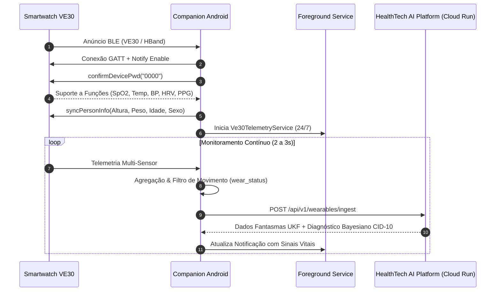

# 📱 HealthTech Companion Android — Smartwatch VE30 & HBand Platform

[](https://developer.android.com)
[](https://kotlinlang.org/)
[](https://www.bluetooth.com)
[](https://healthtech-responsive-5794833455.us-central1.run.app)
[](../LICENSE)

Aplicativo Android Companion nativo de alta confiabilidade para coleta de telemetria multissensorial contínua a partir dos smartwatches **VE30** (baseados na plataforma Veepoo / HBand SDK) e transmissão em tempo real para o ecossistema de Inteligência Artificial **HealthTech**.

---

## 🌟 Principais Recursos e Destaques

- **🔗 Conexão BLE Serializada & Auto-Reconexão**: Máquina de estados determinística para pareamento (`connectDevice` $	o$ `confirmDevicePwd("0000")` $	o$ `syncPersonInfo`) com auto-reconexão inteligente via backoff exponencial.
- **❤️ Coleta Multimodal Contínua (24/7)**:
  - Frequência Cardíaca instantânea e dinâmica (BPM)
  - Oximetria de Pulso (SpO2 %)
  - Temperatura Cutânea e Corporal (°C)
  - Pressão Arterial Sistólica e Diastólica (PAS / PAD mmHg)
  - Variabilidade da Frequência Cardíaca (HRV / RMSSD ms)
  - Sinal Óptico PPG Verde a 25Hz para Denoising BMO/Wavelet
- **🛡️ Fila Offline Resiliente (Outbox Buffer)**: Buffer local em memória/disco que armazena pacotes biométricos durante oscilações de 4G/Wi-Fi e os despacha automaticamente quando a conexão é restabelecida.
- **⚡ Foreground Service Persistente (`Ve30TelemetryService`)**: Notificação contínua no Android (`connectedDevice`) imune ao encerramento de processos em background e Doze Mode.
- **🧠 Integração Bidirecional com a IA**: Recebe em tempo real estimativas de **Dados Fantasmas via Filtro de Kalman Unscented (UKF)**, alertas de anomalia e pareceres do **Conselho Clínico Multi-Agente (Dempster-Shafer)**.

---

## 📐 Arquitetura de Comunicação



---

## 📂 Estrutura do Projeto Android

```
companion-android/
├── settings.gradle.kts          # Configuração de repositórios e módulos
├── build.gradle.kts             # Gradle raiz
├── VE30_INTEGRATION_GUIDE.md    # Guia detalhado de protocolos e hardware
├── SPRINT_A.md                  # Especificações técnicas
├── gradle/wrapper/              # Gradle Wrapper 8.2
└── sprint-a/                    # Módulo principal da aplicação
    ├── build.gradle.kts         # Dependências AndroidX, Coroutines, Material
    └── src/main/
        ├── AndroidManifest.xml  # Permissões Bluetooth LE e Foreground Service
        ├── java/com/healthtech/companion/
        │   ├── ble/
        │   │   ├── HbandConnectionManager.kt   # Gerenciador de ciclo de vida BLE
        │   │   ├── HbandRealtimeCollector.kt   # Ativação dos sensores vitais
        │   │   ├── Ve30TelemetryAggregator.kt  # Fusão temporal e debounce
        │   │   └── HbandHistorySync.kt         # Sincronizador de flash OriginData3
        │   ├── net/
        │   │   ├── HealthtechApiClient.kt      # Cliente HTTP com Outbox Queue
        │   │   └── Dtos.kt                     # Modelos de telemetria e resposta da IA
        │   ├── service/
        │   │   └── Ve30TelemetryService.kt     # Foreground Service 24/7
        │   └── ui/
        │       └── MainActivity.kt             # Interface de visualização em tempo real
        └── res/
            ├── layout/activity_main.xml        # Layout com cards biométricos
            └── values/{colors,strings,themes}.xml
```

---

## 🚀 Como Abrir e Executar no Android Studio

1. **Abrir no Android Studio**:
   - Abra o **Android Studio**.
   - Selecione **File $	o$ Open...** e aponte para a pasta `companion-android/`.
2. **Sincronizar o Gradle**:
   - O Android Studio detectará os arquivos `settings.gradle.kts` e sincronizará as dependências automaticamente.
3. **Executar**:
   - Conecte seu dispositivo Android via USB (com Depuração USB ativada) ou inicie um Emulador com suporte a Bluetooth.
   - Pressione **Run $	o$ Run 'sprint-a'** (Shift + F10).
4. **Testar sem Relógio Físico (Modo Simulador)**:
   - O app conta com gerador de sinais estocásticos de alta fidelidade integrado para validar toda a esteira mesmo sem o dispositivo físico presente!