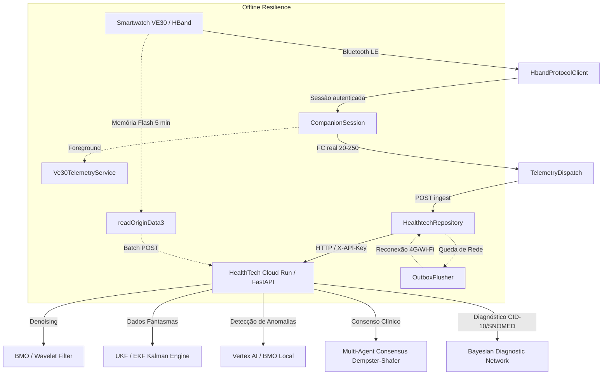

# Guia de Integração e Arquitetura do Relógio Inteligente VE30 / HBand

Este documento detalha o funcionamento e a arquitetura de coleta contínua do **Smartwatch VE30** (plataforma Veepoo / HBand BLE SDK) e sua integração de alta confiabilidade com a plataforma de Inteligência Artificial **HealthTech**.

---

## 1. Visão Geral da Solução

O smartwatch **VE30** é um dispositivo vestível clínico equipado com múltiplos sensores biométricos de alta sensibilidade. Para garantir que as leituras sejam coletadas sem interrupções e enviadas em tempo real para os modelos de IA, a arquitetura foi desenhada em camadas determinísticas:



---

## 2. Componentes do Aplicativo Mobile (`companion-android/`)

O módulo histórico `:sprint-a` (v3.1.0) foi unificado em `:app` (Compose) + `:client` (Retrofit).

| Arquivo / Classe | Responsabilidade | Destaque Técnico |
|---|---|---|
| [`HbandProtocolClient.kt`](app/src/main/java/com/healthtech/companion/ble/HbandProtocolClient.kt) | Ciclo BLE + handshake | Scan, `confirmDevicePwd("0000")`, `syncPersonInfo`, `startDetectHeart`. `stopAllSensors` para HR/SpO2/temp/PA/HRV. OriginData3 **serial** (pausa FC). |
| [`CompanionSession.kt`](app/src/main/java/com/healthtech/companion/ble/CompanionSession.kt) | Dono único do rádio | Application-scoped; Activity e `Ve30TelemetryService` compartilham o mesmo client. |
| [`TelemetryDispatch.kt`](client/src/main/java/com/healthtech/companion/telemetry/TelemetryDispatch.kt) | Regras de ingest | Só despacha com FC 20–250; **não** inventa SpO2 98 / HR 72. |
| [`PpgBuffer.kt`](client/src/main/java/com/healthtech/companion/telemetry/PpgBuffer.kt) | Buffer PPG | Fila ordenada com capacidade (não `Set<Double>`). |
| [`HealthtechRepository.kt`](client/src/main/java/com/healthtech/companion/net/HealthtechRepository.kt) | Cliente HTTP | `/api/v1/wearables/ingest` e `/batch-ingest`, outbox em memória. |
| [`Ve30TelemetryService.kt`](app/src/main/java/com/healthtech/companion/service/Ve30TelemetryService.kt) | Foreground `connectedDevice` | Processo vivo em background; **não** cria um segundo `VPOperateManager`. |
| [`MainScreen.kt`](app/src/main/java/com/healthtech/companion/ui/MainScreen.kt) | UI | Lista de scan, vitais, card 401/403, botão **Histórico flash**. |

---

## 3. Contrato de Ingestão de Dados na IA (`POST /api/v1/wearables/ingest`)

IDs de contrato (SPRINT_A.md + OpenAPI): `patient_id=PAT-HBAND-001`,
`device_id=HBAND-{MAC}`. O prefixo `VE30-` / `PAT-VE30-001` era do módulo
histórico e o app reescreve `VE30-` → `HBAND-`.

### Payload Enviado pelo App:
```json
{
  "patient_id": "PAT-HBAND-001",
  "device_id": "HBAND-E4:65:08:AA:BB:CC",
  "heart_rate": 76.0,
  "spo2": 98.5,
  "skin_temp": 33.4,
  "blood_pressure_sys": 122.0,
  "blood_pressure_dia": 81.0,
  "hrv_rmssd": 44.0,
  "steps": 1250,
  "wear_status": true,
  "ppg_signal": [500.0, 520.0, 560.0, 610.0, 580.0, 530.0],
  "filter_type": "BMO",
  "timestamp": "2026-08-19T21:40:00Z",
  "device": {
    "device_id": "HBAND-E4:65:08:AA:BB:CC",
    "vendor": "hband",
    "model": "VE30",
    "battery_level": 88.0
  }
}
```

### Resposta Enriquecida da Plataforma de IA:
```json
{
  "status": "success",
  "patient_id": "PAT-HBAND-001",
  "device_id": "HBAND-E4:65:08:AA:BB:CC",
  "timestamp": "2026-08-19T21:40:00Z",
  "phantom_data": {
    "systolic_bp": {"estimate": 120.4, "ci_lower": 110.2, "ci_upper": 130.6, "reliable": true},
    "diastolic_bp": {"estimate": 80.1, "ci_lower": 72.0, "ci_upper": 88.2, "reliable": true},
    "spo2": {"estimate": 98.2, "ci_lower": 96.0, "ci_upper": 100.0, "reliable": true},
    "vagal_tone": {"estimate": 51.3, "ci_lower": 35.0, "ci_upper": 67.6, "reliable": true},
    "glucose": {"estimate": 99.8, "ci_lower": 82.0, "ci_upper": 117.6, "reliable": true}
  },
  "anomaly_detection": {
    "alerta": false,
    "score": 0.05,
    "modo": "Deteção Local BMO"
  },
  "diagnostic_hypotheses": [
    {
      "category": "cardiovascular",
      "probability": 0.048,
      "severity": "low",
      "confidence": "high"
    }
  ],
  "clinical_codes": {
    "icd10": ["I10", "I11", "I25"],
    "snomed": ["38341003", "49436004"]
  },
  "multi_agent_consensus": {
    "consensus_risk": "low",
    "action_summary": "Estabilidade clínica observada pelos 3 agentes especialistas.",
    "probabilities": {
      "low": 0.92,
      "moderate": 0.06,
      "high": 0.02
    }
  }
}
```

---

## 4. Instruções para Compilação e Instalação do APK

1. **AARs do SDK oficial Veepoo / HBand**: já estão vendorizados em
   `companion-android/app/libs/` (vindos de https://github.com/HBandSDK/Android_Ble_SDK).
2. **Configurar a `X-API-Key` de ingestão** (nunca commitar a chave):
   - Criar `companion-android/local.properties` (gitignored) com:
     ```properties
     HEALTHTECH_INGEST_API_KEY=sua-chave-aqui
     HEALTHTECH_PATIENT_ID=PAT-HBAND-001
     ```
   - Ou definir `HEALTHTECH_INGEST_API_KEY` no ambiente antes do build.
   - O valor vai para `BuildConfig.DEFAULT_INGEST_API_KEY` e a UI (`AppPrefs`). Sem chave, o ingest recusa enviar.
3. **Compilar**:
   ```bash
   cd companion-android
   ./gradlew :app:assembleDebug :client:testDebugUnitTest :app:testDebugUnitTest
   ```
4. **Instalar**:
   ```bash
   adb install -r app/build/outputs/apk/debug/app-debug.apk
   ```
5. **Executar**: conceder Bluetooth + notificações, **Escanear**, tocar na pulseira.

> **Modo sem relógio físico**: botão **Simular** (`ingest_source=ble_sim`). Não é pairing HBand.
