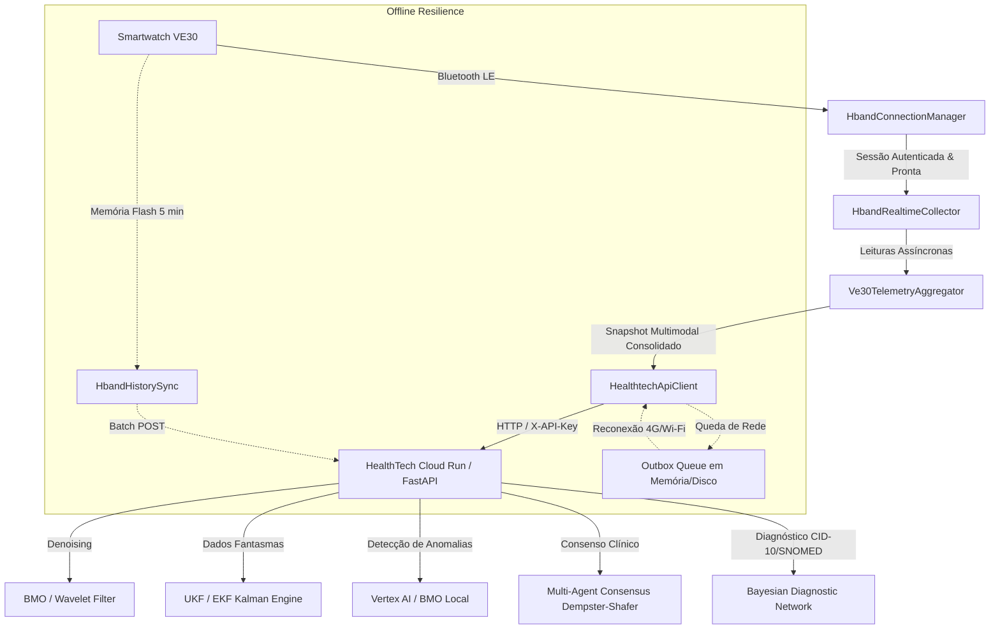

# Guia de Integração e Arquitetura do Relógio Inteligente VE30 / HBand

Este documento detalha o funcionamento e a arquitetura de coleta contínua do **Smartwatch VE30** (plataforma Veepoo / HBand BLE SDK) e sua integração de alta confiabilidade com a plataforma de Inteligência Artificial **HealthTech**.

---

## 1. Visão Geral da Solução

O smartwatch **VE30** é um dispositivo vestível clínico equipado com múltiplos sensores biométricos de alta sensibilidade. Para garantir que as leituras sejam coletadas sem interrupções e enviadas em tempo real para os modelos de IA, a arquitetura foi desenhada em camadas determinísticas:



---

## 2. Componentes do Aplicativo Mobile (`companion-android/`)

| Arquivo / Classe | Responsabilidade | Destaque Técnico |
|---|---|---|
| [`HbandConnectionManager.kt`](sprint-a/src/main/java/com/healthtech/companion/ble/HbandConnectionManager.kt) | Gerenciador de ciclo de vida BLE | Scan com filtro VE30/HBand, autenticação serial (`confirmDevicePwd` com `"0000"`), descoberta de suporte a funções (`FunctionDeviceSupportData`) e sincronização corporal (`syncPersonInfo`). Auto-reconexão com backoff exponencial. |
| [`HbandRealtimeCollector.kt`](sprint-a/src/main/java/com/healthtech/companion/ble/HbandRealtimeCollector.kt) | Ativação e leitura multissensorial | Monitoramento contínuo de Frequência Cardíaca, Oximetria SpO2, Temperatura Cutânea/Corporal, Pressão Arterial (PAS/PAD) e PPG verde a 25Hz. |
| [`Ve30TelemetryAggregator.kt`](sprint-a/src/main/java/com/healthtech/companion/ble/Ve30TelemetryAggregator.kt) | Agregador temporal de sinais vitais | Janela deslizante de fusão (2 a 3s), filtragem de artefatos de movimento, detecção de contato com o pulso (`wear_status`) e debounce de envio. |
| [`HbandHistorySync.kt`](sprint-a/src/main/java/com/healthtech/companion/ble/HbandHistorySync.kt) | Sincronizador de flash offline | Descarrega pacotes de 5 minutos `OriginData3`, registros de sono e passos quando o paciente se afasta do celular e reconecta. |
| [`HealthtechApiClient.kt`](sprint-a/src/main/java/com/healthtech/companion/net/HealthtechApiClient.kt) | Cliente HTTP Resiliente | Ingestão em tempo real (`/api/v1/wearables/ingest`), ingestão em lote (`/api/v1/wearables/ingest/batch`), fila outbox offline persistente com reenvio automático e deserialização das inferências da IA. |
| [`Ve30TelemetryService.kt`](sprint-a/src/main/java/com/healthtech/companion/service/Ve30TelemetryService.kt) | Foreground Service 24/7 | Notificação persistente `NotificationCompat` com tipo `connectedDevice`, mantendo o processo vivo mesmo com a tela desligada (imunidade ao Doze Mode). |
| [`MainActivity.kt`](sprint-a/src/main/java/com/healthtech/companion/ui/MainActivity.kt) | Interface do Usuário | UI reativa com feedback de FC, SpO2, Temperatura, PA estimada e alertas clínicos em tempo real. |

---

## 3. Contrato de Ingestão de Dados na IA (`POST /api/v1/wearables/ingest`)

### Payload Enviado pelo App:
```json
{
  "patient_id": "PAT-VE30-001",
  "device_id": "VE30-E4:65:08:AA:BB:CC",
  "heart_rate": 76.0,
  "spo2": 98.5,
  "skin_temp": 33.4,
  "blood_pressure_sys": 122.0,
  "blood_pressure_dia": 81.0,
  "hrv_rmssd": 44.0,
  "steps": 1250,
  "wear_status": true,
  "ppg_signal": [500.0, 520.0, 560.0, 610.0, 580.0, 530.0],
  "filter_type": "BMO",
  "timestamp": "2026-08-19T21:40:00Z",
  "device": {
    "device_id": "VE30-E4:65:08:AA:BB:CC",
    "vendor": "hband",
    "model": "VE30",
    "battery_level": 88.0
  }
}
```

### Resposta Enriquecida da Plataforma de IA:
```json
{
  "status": "success",
  "patient_id": "PAT-VE30-001",
  "device_id": "VE30-E4:65:08:AA:BB:CC",
  "timestamp": "2026-08-19T21:40:00Z",
  "phantom_data": {
    "systolic_bp": {"estimate": 120.4, "ci_lower": 110.2, "ci_upper": 130.6, "reliable": true},
    "diastolic_bp": {"estimate": 80.1, "ci_lower": 72.0, "ci_upper": 88.2, "reliable": true},
    "spo2": {"estimate": 98.2, "ci_lower": 96.0, "ci_upper": 100.0, "reliable": true},
    "vagal_tone": {"estimate": 51.3, "ci_lower": 35.0, "ci_upper": 67.6, "reliable": true},
    "glucose": {"estimate": 99.8, "ci_lower": 82.0, "ci_upper": 117.6, "reliable": true}
  },
  "anomaly_detection": {
    "alerta": false,
    "score": 0.05,
    "modo": "Deteção Local BMO"
  },
  "diagnostic_hypotheses": [
    {
      "category": "cardiovascular",
      "probability": 0.048,
      "severity": "low",
      "confidence": "high"
    }
  ],
  "clinical_codes": {
    "icd10": ["I10", "I11", "I25"],
    "snomed": ["38341003", "49436004"]
  },
  "multi_agent_consensus": {
    "consensus_risk": "low",
    "action_summary": "Estabilidade clínica observada pelos 3 agentes especialistas.",
    "probabilities": {
      "low": 0.92,
      "moderate": 0.06,
      "high": 0.02
    }
  }
}
```

---

## 4. Instruções para Compilação e Instalação do APK

1. **AARs do SDK oficial Veepoo / HBand**: já estão vendorizados em
   `companion-android/sprint-a/libs/` (vindos de https://github.com/HBandSDK/Android_Ble_SDK,
   Apache 2.0 — ver [`libs/THIRD_PARTY_NOTICE.md`](sprint-a/libs/THIRD_PARTY_NOTICE.md) para a
   proveniência de cada arquivo). Não é necessário baixar nada manualmente.
2. **Configurar a `X-API-Key` de ingestão** (nunca commitar a chave):
   - Criar `companion-android/local.properties` (gitignored) com:
     ```properties
     HEALTHTECH_INGEST_API_KEY=sua-chave-aqui
     ```
   - Ou exportar a variável de ambiente `HEALTHTECH_INGEST_API_KEY` antes do build.
   - O valor é injetado em `BuildConfig.HEALTHTECH_INGEST_API_KEY` e lido por `MainActivity` e `Ve30TelemetryService` — sem chave, o app roda sem o header `X-API-Key`.
3. **Compilar via Linha de Comando ou Android Studio**:
   ```bash
   cd companion-android
   ./gradlew assembleDebug
   ```
4. **Instalar no Smartphone**:
   ```bash
   adb install -r sprint-a/build/outputs/apk/debug/sprint-a-debug.apk
   ```
5. **Executar**:
   - Abrir o app **HealthTech VE30**, conceder as permissões de Bluetooth e Notificação, pressionar **Scan** e conectar ao relógio VE30!

> **Modo sem relógio físico**: `HbandRealtimeCollector.startSimulatedSensors()` gera um fluxo
> fisiológico estocástico sintético para validar a esteira de agregação/ingestão sem hardware —
> não é chamado automaticamente; use-o manualmente em builds de debug quando não houver um VE30 por perto.
