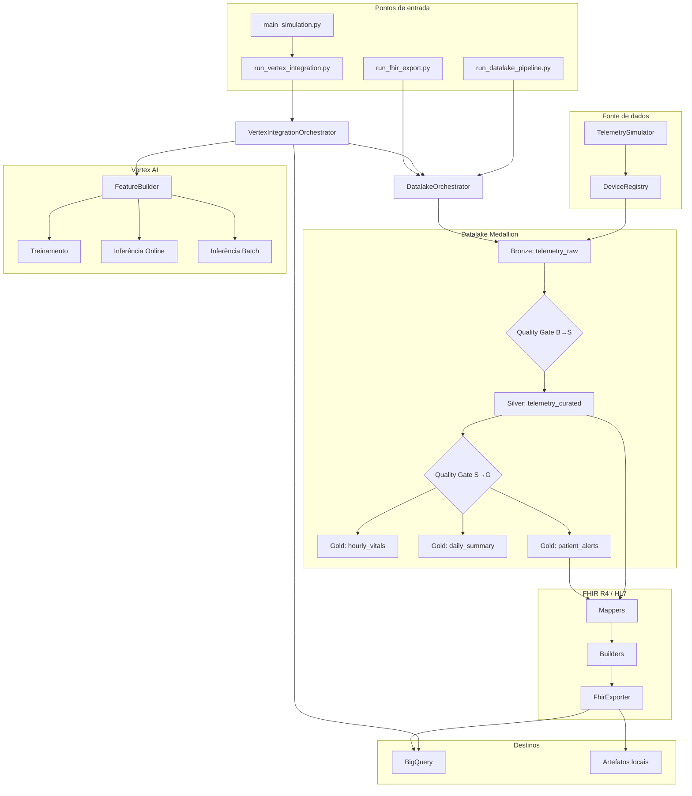
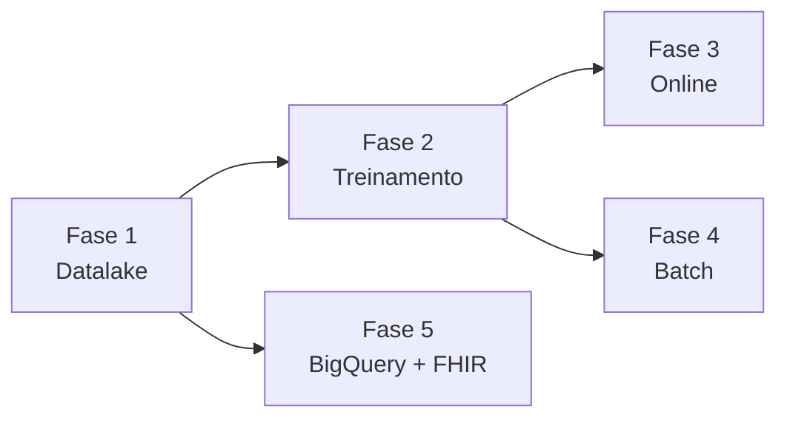
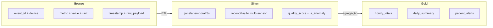
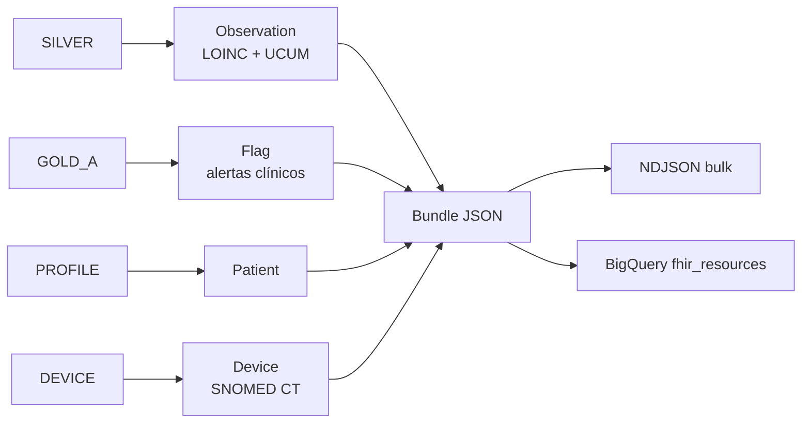

# Arquitetura

## Diagrama de fluxo completo

## Pipeline integrado (Vertex)

Corresponde a `run_vertex_integration.py` e `main_simulation.py`:

| Fase | Módulo | Saída |
|------|--------|-------|
| 1 | `DatalakeOrchestrator` | `data/lakehouse/`, Bundle FHIR |
| 2 | `VertexTrainingPipeline` | `data/models/`, CSV treino |
| 3 | `VertexOnlinePipeline` | Alertas em tempo real |
| 4 | `VertexBatchPipeline` | JSONL + predições |
| 5 | `BigQueryBridge` | BQ ou `data/bigquery_simulation/` |

## Arquitetura Medallion

## Camada FHIR

## Modos de operação

| Modo | Condição | Comportamento |
|------|----------|---------------|
| Local | `GCP_PROJECT_ID` não configurado | Parquet + simulação BQ/Vertex |
| GCP | Credenciais + `.env` válido | BigQuery sync + Vertex Endpoint |
| Híbrido | GCP parcial | Fallback local com log de aviso |

## Diagramas estáticos

Arquivos em `docs/diagrams/`:

| Arquivo | Conteúdo |
|---------|----------|
| `01-visao-geral.mmd` | Visão geral do sistema |
| `02-sequencia.mmd` | Sequência de execução |
| `03-medallion.mmd` | Camadas Bronze/Silver/Gold |
| `04-vertex-modos.mmd` | Modos Vertex AI |
| `05-fhir-hl7.mmd` | Fluxo FHIR R4 |
| `fluxo-completo.mmd` | Pipeline end-to-end atualizado |

SVGs/PNGs gerados a partir dos `.mmd` estão na mesma pasta.